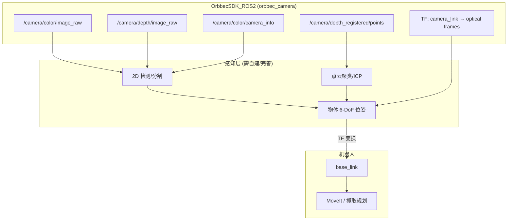

下面结合你仓库里已有的 `OrbbecSDK_ROS2` 源码和 OpenArm 集成方式，说明 **Gemini 336L** 能做什么、怎样开才能支撑**机器人视觉定位 / 物体 3D 位置**。

---

## 1. 功能包结构

`OrbbecSDK_ROS2` 在你工程里包含 3 个子包：

| 包名 | 作用 |
|------|------|
| `orbbec_camera` | 核心驱动：采集数据、发布 Topic、TF、深度滤波、点云 |
| `orbbec_camera_msgs` | 自定义消息/服务（设备信息、外参、滤波器、标定等） |
| `orbbec_description` | 336L 的 URDF 模型（`gemini335L_336L.urdf.xacro`） |

336L 属于 **Gemini 330 系列**，官方推荐启动文件：

```bash
ros2 launch orbbec_camera gemini_330_series.launch.py
```

推荐固件：**1.6.00**（见 `README_CN.MD`）。

---

## 2. 336L 能提供的能力

### 数据流（Topics）

默认命名空间 `camera_name:=camera` 时，主要 Topic 为：

| Topic | 类型 | 用途 |
|-------|------|------|
| `/camera/color/image_raw` | Image | RGB 图像（检测/分割） |
| `/camera/color/camera_info` | CameraInfo | 彩色相机内参（反投影必需） |
| `/camera/depth/image_raw` | Image | 深度图（Y16，单位 mm） |
| `/camera/depth/camera_info` | CameraInfo | 深度相机内参 |
| `/camera/depth/points` | PointCloud2 | 3D 点云（XYZ） |
| `/camera/depth_registered/points` | PointCloud2 | **彩色点云**（XYZRGB，需开启） |
| `/camera/left_ir/image_raw` 等 | Image | 红外（可选） |
| `/camera/depth_to_color` | Extrinsics | 深度→彩色外参（需开启） |

### TF 坐标系

驱动会自动发布（`publish_tf:=true`）：

```
camera_link
  └── camera_depth_frame
        ├── camera_depth_optical_frame
        ├── camera_color_frame → camera_color_optical_frame
        ├── camera_left_ir_frame → camera_left_ir_optical_frame
        └── camera_right_ir_frame → camera_right_ir_optical_frame
```

**物体 3D 位置**最终要变换到 `base_link`（机器人基座），需要：
1. 相机驱动提供 `camera_*_optical_frame` + 内参
2. 机器人 URDF 里把 `camera_link` 固定到头部/躯干
3. 用 TF 做 `camera_optical_frame → base_link` 变换

### 服务（运行时调参）

`default_service.yaml` 里列出了大量服务，对定位有用的包括：

- `/camera/set_filter` — 深度滤波（去噪、空洞填充等）
- `/camera/set_user_calib_params` / `/camera/get_user_calib_params` — 用户标定
- `/camera/save_point_cloud` — 保存点云调试
- `/camera/set_laser_enable` — 激光投射器开关（影响深度质量）
- `/camera/get_device_info` — 设备信息

### 深度后处理

Launch 里可配置：

- `depth_registration` — **深度对齐到彩色**（D2C，视觉定位关键）
- `enable_noise_removal_filter` — 软件去噪（336L 默认开启）
- `enable_spatial_filter` / `enable_temporal_filter` — 空间/时间滤波
- `enable_hole_filling_filter` — 空洞填充
- `align_mode` — `SW`（软件对齐）或 `HW`（硬件对齐）
- `device_preset` — 深度预设（近距离/高精度等，见 [Gemini 330 深度预设文档](https://www.orbbec.com/docs/g330-use-depth-presets/)）

---

## 3. 视觉定位需要什么？

目标：**知道视野内物体在机器人坐标系下的 (x, y, z) 位姿**。

OrbbecSDK_ROS2 **本身不提供**“物体识别+定位”算法，它提供的是**传感器层能力**。完整链路是：

```
OrbbecSDK_ROS2（传感器数据）
    ↓
感知算法（分割/聚类/ICP/模板匹配）
    ↓
TF 变换到 base_link
    ↓
机器人运动规划/抓取
```

你仓库里 `openarm_perception` 已规划这条路径（目前是 stub）：

```24:29:src/openarm_perception/README.md
1. Subscribe to the Orbbec point-cloud topic (`/camera/depth/color/points`).
2. Apply pass-through + Statistical Outlier Removal filters.
3. Euclidean cluster extraction (radius / min/max cluster size from YAML).
4. ICP registration against `share/openarm_perception/templates/<name>.pcd`.
5. Plane fitting on the place region for the `rpy` component.
6. Transform `camera_link -> base_link` via TF.
```

**注意**：Orbbec 实际 Topic 是 `/camera/depth/points` 或 `/camera/depth_registered/points`，**不是** RealSense 风格的 `/camera/depth/color/points`。MoveIt 配置里写错了：

```3:6:src/openarm_ros2/openarm_bimanual_moveit_config/config/sensors_3d.yaml
gemini_336l_pointcloud:
  sensor_plugin: occupancy_map_monitor/PointCloudOctomapUpdater
  point_cloud_topic: /camera/depth/color/points
```

应改为 `/camera/depth_registered/points` 或 `/camera/depth/points`（取决于你是否开启 D2C）。

---

## 4. 推荐启动配置（最大化视觉定位能力）

当前 `openarm_mimic` 的 launch **关闭了关键功能**：

```74:78:src/openarm_mimic/launch/mimic.launch.py
        launch_arguments={
            'camera_name': 'camera',
            'depth_registration': 'false',
            'enable_point_cloud': 'false',
            'enable_colored_point_cloud': 'false',
```

用于**视觉定位**应改为类似下面这样启动：

```bash
source /home/sunrise/code/openArm/install/setup.bash

# 1. 确认相机已连接
ros2 run orbbec_camera list_devices_node

# 2. 以视觉定位模式启动（仅相机）
ros2 launch orbbec_camera gemini_330_series.launch.py \
  camera_name:=camera \
  depth_registration:=true \
  align_mode:=SW \
  align_target_stream:=COLOR \
  enable_point_cloud:=true \
  enable_colored_point_cloud:=true \
  enable_frame_sync:=true \
  publish_tf:=true \
  enable_publish_extrinsic:=true \
  enable_noise_removal_filter:=true \
  enable_spatial_filter:=true \
  enable_hole_filling_filter:=true \
  enable_laser:=true \
  color_width:=1280 \
  color_height:=720 \
  color_fps:=30 \
  depth_width:=848 \
  depth_height:=480 \
  depth_fps:=30 \
  left_ir_width:=848 left_ir_height:=480 left_ir_fps:=30 \
  right_ir_width:=848 right_ir_height:=480 right_ir_fps:=30 \
  enable_left_ir:=true enable_right_ir:=true \
  point_cloud_qos:=sensor_data \
  log_level:=none
```

**一键启动（推荐）**：语音助手 + Orbbec 同一终端，无需分开 launch：

```bash
source /home/sunrise/code/openArm/install/setup.bash
ros2 launch largemodel largemodel_control.launch.py orbbec:=true
```

仅语音、不启相机（默认）：

```bash
ros2 launch largemodel largemodel_control.launch.py
```

> **image_transport 报错（已修复）**  
> 若日志出现 `Failed to load plugin image_transport/compressed_pub`，原因是系统未安装压缩传输插件。  
> 已在板端安装：`ros-humble-compressed-image-transport`、`ros-humble-image-transport-plugins`。  
> 若无法 apt 安装，可仅发布 raw：在命令末尾追加  
> `'color.image_raw.enable_pub_plugins':='["image_transport/raw"]'`（launch 参数格式因 shell 而异，见官方文档）。

**各参数含义：**

| 参数 | 建议值 | 原因 |
|------|--------|------|
| `depth_registration:=true` | 必须 | 深度像素与彩色像素对齐，2D 检测可直接取深度 |
| `enable_point_cloud:=true` | 必须 | 发布 `/camera/depth/points` |
| `enable_colored_point_cloud:=true` | 推荐 | 发布 `/camera/depth_registered/points`（XYZRGB，便于分割+聚类） |
| `enable_frame_sync:=true` | 必须 | 彩色/深度时间同步 |
| `publish_tf:=true` | 必须 | 发布相机坐标系 |
| `enable_publish_extrinsic:=true` | 推荐 | 发布 depth→color 外参 |
| `enable_*_filter` | 按需 | 提升深度稳定性，减少定位抖动 |
| 分辨率 848×480 / 1280×720 | 336L 默认 | SDK 配置里 336L 的默认分辨率；需 **USB 3.0** |

---

## 5. 从像素到物体 3D 位置的两种路径

### 路径 A：RGB 检测 + 深度反投影（轻量、实时）

适合已知类别物体（杯子、盒子等）：

1. 订阅 `/camera/color/image_raw` + `/camera/depth/image_raw` + `/camera/color/camera_info`
2. 在彩色图上做 2D 检测/分割，得到像素 `(u, v)`
3. 因为 `depth_registration:=true`，深度图已对齐到彩色，直接读 `depth(u,v)`
4. 用 `camera_info` 反投影到 `camera_color_optical_frame`：

```python
# 伪代码
x = (u - cx) * depth / fx
y = (v - cy) * depth / fy
z = depth
```

5. 用 TF 变换到 `base_link`

### 路径 B：点云聚类 + ICP（更精确，适合抓取）

适合 `openarm_perception` 规划的方案：

1. 订阅 `/camera/depth_registered/points`
2. PCL：PassThrough → 统计离群点去除 → 欧氏聚类
3. 与模板 PCD 做 ICP，得到 6-DoF 位姿
4. TF 变换到 `base_link`
5. 精度目标：连续两帧差异 < 3 mm（见 perception README）

---

## 6. 系统架构示意



---

## 7. 验证步骤

启动相机后，按顺序检查：

```bash
# Topic 是否在发
ros2 topic list | grep camera
ros2 topic hz /camera/depth_registered/points
ros2 topic hz /camera/color/image_raw

# 内参是否正确
ros2 topic echo /camera/color/camera_info --once

# TF 是否完整
ros2 run tf2_tools view_frames

# RViz 看点云
rviz2
# Fixed Frame 设为 camera_link 或 base_link
# 添加 PointCloud2 → /camera/depth_registered/points
```

---

## 8. 精度相关建议

1. **手眼标定**：用 `orbbec_description` 的 URDF 把相机装到机器人上，并做实际标定（`set_user_calib_params` 或外部标定工具）
2. **固定安装**：336L 是长基线结构光，相机晃动会直接影响深度精度
3. **工作距离**：336L 有效深度大约 0.2–3 m（具体看预设），物体放在相机最佳量程内
4. **光照**：避免强反光、纯黑表面；必要时调 `device_preset`
5. **USB 3.0**：低分辨率 launch（如 mimic 里的 640×400）是为降 CPU，**不是**最高精度配置
6. **滤波权衡**：`temporal_filter` 会平滑但增加延迟；抓取实时性要求高时可只用 spatial + noise removal

---

## 9. 与你当前工程的差距

| 模块 | 现状 | 需要做的 |
|------|------|----------|
| `openarm_mimic.launch.py` | 关闭了点云和 D2C | 改为上面的视觉定位参数 |
| `openarm_perception` | 返回静态 stub 位姿 | 实现点云/ICP 真实 pipeline |
| `sensors_3d.yaml` | Topic 名错误 | 改为 `/camera/depth_registered/points` |
| 机器人 URDF | 需确认 camera_link 安装位姿 | 加入 336L 并做手眼标定 |

---

## 10. 总结

**OrbbecSDK_ROS2 对 336L 的核心价值**是：同步 RGB-D、对齐深度、点云、内参/外参、TF、深度滤波——这些是视觉定位的**数据基础**。

要满足“精确知道物体 3D 位置”，最少需要开启：

- `depth_registration:=true`
- `enable_point_cloud:=true`
- `enable_colored_point_cloud:=true`（推荐）
- `publish_tf:=true`
- 机器人侧 `camera_link → base_link` 标定
- 上层感知（2D+深度反投影，或点云聚类+ICP）

如果你希望，我可以下一步直接帮你：
1. 写一个专用的 `gemini_336l_localization.launch.py`；
2. 修正 `sensors_3d.yaml` 和 `mimic.launch.py` 的相机参数；
3. 在 `openarm_perception` 里实现最小可用的点云物体定位节点。